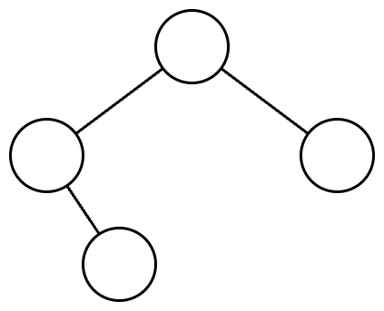

# 표현 가능한 이진트리

## 문제 설명

당신은 이진트리를 수로 표현하는 것을 좋아합니다.

이진트리를 수로 표현하는 방법은 다음과 같습니다.

1. 이진수를 저장할 빈 문자열을 생성합니다.
2. 주어진 이진트리에 더미 노드를 추가하여 포화 이진트리로 만듭니다. 루트 노드는 그대로 유지합니다.
3. 만들어진 포화 이진트리의 노드들을 가장 왼쪽 노드부터 가장 오른쪽 노드까지, 왼쪽에 있는 순서대로 살펴봅니다. 노드의 높이는 살펴보는 순서에 영향을 끼치지 않습니다.
4. 살펴본 노드가 더미 노드라면, 문자열 뒤에 0을 추가합니다. 살펴본 노드가 더미 노드가 아니라면, 문자열 뒤에 1을 추가합니다.
5. 문자열에 저장된 이진수를 십진수로 변환합니다.

**이진트리에서 리프 노드가 아닌 노드는 자신의 왼쪽 자식이 루트인 서브트리의 노드들보다 오른쪽에 있으며, 자신의 오른쪽 자식이 루트인 서브트리의 노드들보다 왼쪽에 있다고 가정합니다.**

다음은 이진트리를 수로 표현하는 예시입니다.

주어진 이진트리는 다음과 같습니다.



주어진 이진트리에 더미노드를 추가하여 포화 이진트리로 만들면 다음과 같습니다. **더미 노드는 점선으로 표시하였고, 노드 안의 수는 살펴보는 순서를 의미합니다.**


노드들을 왼쪽에 있는 순서대로 살펴보며 0과 1을 생성한 문자열에 추가하면 `"0111010"`이 됩니다. 이 이진수를 십진수로 변환하면 58입니다.

당신은 수가 주어졌을때, 하나의 이진트리로 해당 수를 표현할 수 있는지 알고 싶습니다.

이진트리로 만들고 싶은 수를 담은 1차원 정수 배열 `numbers`가 주어집니다. `numbers`에 주어진 순서대로 하나의 이진트리로 해당 수를 표현할 수 있다면 1을, 표현할 수 없다면 0을 1차원 정수 배열에 담아 return 하도록 solution 함수를 완성해주세요.

## 제한사항

- 1 ≤ `numbers`의 길이 ≤ 10,000
- 1 ≤ `numbers`의 원소 ≤ 1015

## 입출력 예

| numbers       | result    |
| ------------- | --------- |
| [7, 42, 5]    | [1, 1, 0] |
| [63, 111, 95] | [1, 1, 0] |

## 입출력 예 설명

### 입출력 예 #1

7은 다음과 같은 이진트리로 표현할 수 있습니다.


42는 다음과 같은 이진트리로 표현할 수 있습니다.


5는 이진트리로 표현할 수 없습니다.

따라서, [1, 0]을 return 하면 됩니다.

### 입출력 예 #2

63은 다음과 같은 이진트리로 표현할 수 있습니다.


111은 다음과 같은 이진트리로 표현할 수 있습니다.


95는 이진트리로 표현할 수 없습니다.

따라서, [1, 1, 0]을 return 하면 됩니다.

## 문제 풀이

중요한 점은 주어진 10진수를 2진수로 만들고, 해당 형태를 포화 이진 트리로 만들었을 때, 해당 포화 트리가 성립할 수 있느냐다. 이는 자식이 1의 값을 가질 때, 부모의 값이 0인 경우는 성립할 수 없을 경우를 찾아야한다는 뜻이다.

예를 들어 5같은 경우 이진수로 나타내면 101인데, 이를 이진 포화트리로 나타냈을 경우엔 자식은 모두 1인데 부모는 0이 되므로 성립할 수 없다. 하지만 2나 6, 3 같은 숫자는 부모가 1이고 자식이 0이거나 1인 경우이므로 성립한다.

여기서 제일 헷갈렸던 부분은 주어진 수를 이진수에 만들고, 이를 이진 포화 트리로 재구성하는 부분이었는데, 아래 식을 통해서 이진 포화 트리를 만들기 위한 자리수를 구할 수 있었다.

```python
digit = 2 ** (int(math.log(len(number), 2)) + 1) - 1
```

따라서 이진수로 바꾼 문자열 수를 해당 숫자에 맞춰 '0'을 채워 넣고, 해당 문자열이 올바른 이진 포화 트리를 이루는지 확인하면 된다.
